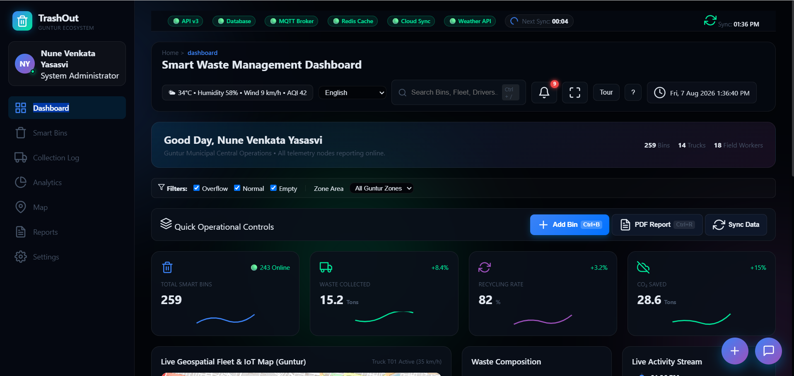
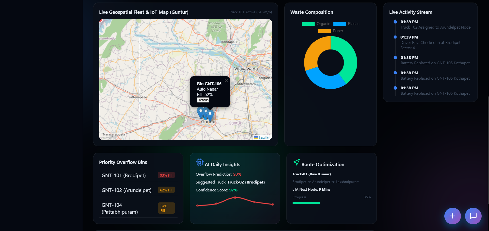
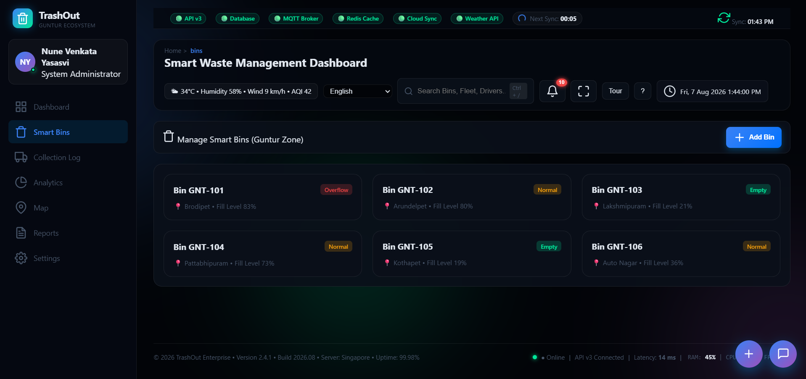
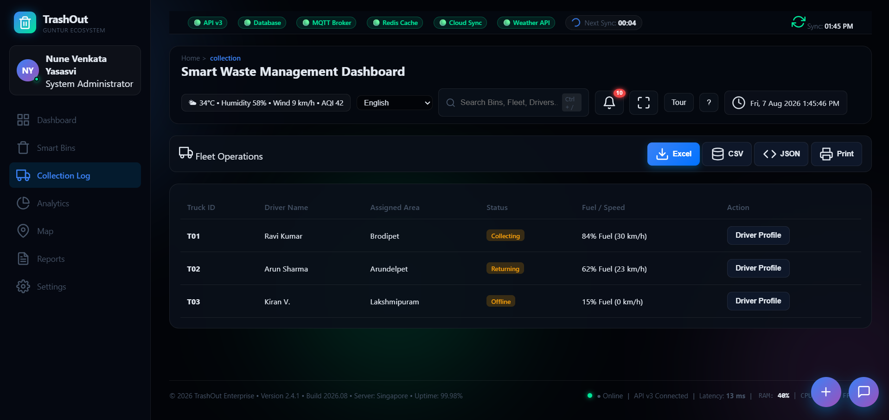
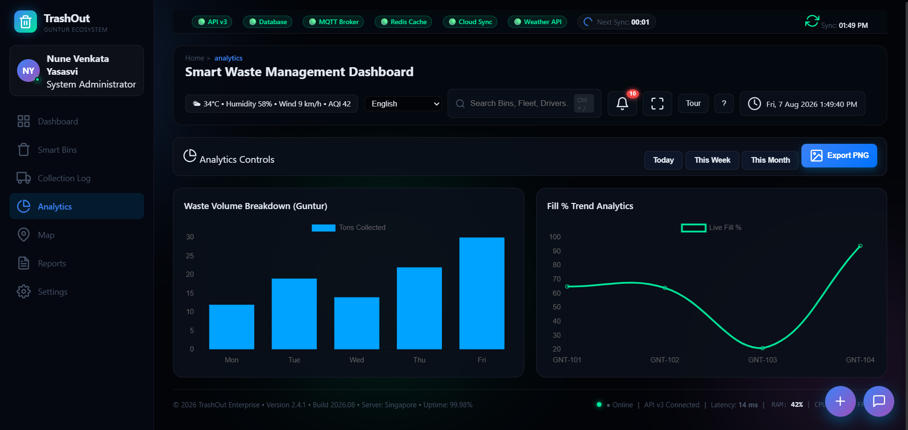
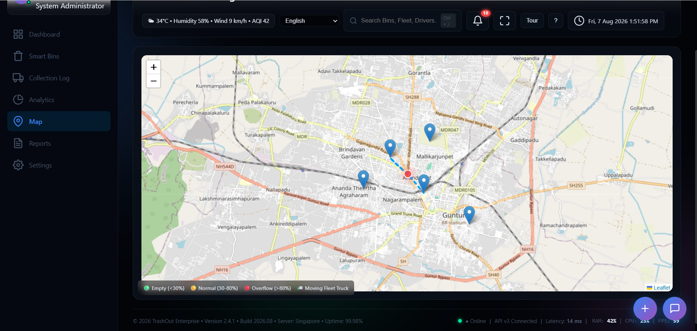

# ♻️ REALTIME PROJECT-1: Smart Waste Management Dashboard

A responsive **Smart Waste Management Dashboard** built using **HTML5, CSS3, and JavaScript** to monitor waste bin levels, collection status, recycling data, fleet operations, and analytics through interactive charts and real-time updates.

> **Task Objective:** Build a responsive dashboard using HTML, CSS, and JavaScript to monitor waste bin levels, collection status, and recycling data through interactive charts and real-time updates.

---

## 🌐 Live Demo

🔗 **Live Demo:**  
[Open Realtime Project 1 – Smart Waste Management Dashboard](https://yasasvi2025.github.io/SpireX_Foundation_Frontend_Development_Internship_Tasks/REALTIME-PROJECT-1-Smart-Waste-Management-Dashboard/index.html)

---

# ✨ Features

- 📊 Smart Waste Dashboard
- 🗑️ Waste Bin Monitoring
- 🚛 Fleet Collection Status
- 📈 Interactive Charts & Analytics
- ♻️ Recycling Statistics
- 🗺️ GIS Map Integration
- 🤖 AI Copilot Assistant
- 🔔 Notifications
- 🔍 Global Search
- 🌦️ Weather Widget
- 🌙 Dark / Light Theme
- 🌍 Multi-language Support
- 👤 Role-Based Login
- 📄 Export Reports (PDF, Excel, CSV, JSON)
- ⚡ Live Dashboard Updates
- 📱 Fully Responsive Design
- 🎨 Modern Glassmorphism UI

---

# 🛠️ Technologies Used

- HTML5
- CSS3
- JavaScript (ES6)
- Chart.js
- Leaflet.js
- Feather Icons

---

# 📂 Project Structure

```text
REALTIME-PROJECT-1-Smart-Waste-Management-Dashboard/
│
├── index.html
├── README.md
└── assets/
    ├── dashboard-1.png
    ├── dashboard-2.png
    ├── smart-bins.png
    ├── fleet-operations.png
    ├── analytics.png
    └── map.png
```

---

# 🚀 Getting Started

## 1. Clone the Repository

```bash
git clone https://github.com/Yasasvi2025/SpireX_Foundation_Frontend_Development_Internship_Tasks.git
cd SpireX_Foundation_Frontend_Development_Internship_Tasks
```

## 2. Open the Project

Navigate to:

```text
REALTIME-PROJECT-1-Smart-Waste-Management-Dashboard
```

Open the **index.html** file using one of these methods:

- Double-click **index.html**
- Open with **Live Server** in Visual Studio Code

### For Windows (Optional)

```cmd
cd "REALTIME-PROJECT-1-Smart-Waste-Management-Dashboard"
start index.html
```

---

# 🖥️ Dashboard Modules

- Dashboard Overview
- Smart Waste Bins
- Fleet Operations
- Collection Analytics
- Recycling Statistics
- Interactive Charts
- GIS Map
- Notifications
- AI Copilot
- Reports
- Settings

---

# 📊 Dashboard Features

- Live KPI Cards
- Waste Bin Status
- Collection Progress
- Interactive Charts
- Fleet Monitoring
- AI Insights
- Real-time Dashboard Updates
- Search Functionality
- Notifications
- Theme Switching
- Report Export
- Responsive Layout

---

# 📸 Dashboard Preview

## 🏠 Dashboard

### Main Dashboard



### Dashboard Overview



---

## 🗑️ Smart Waste Bins



---

## 🚛 Fleet Operations



---

## 📊 Analytics Dashboard



---

## 🗺️ Smart Waste Map



---

# 🎯 Learning Outcomes

This project demonstrates:

- HTML5 Semantic Structure
- CSS3 Responsive Dashboard Design
- JavaScript DOM Manipulation
- Interactive Dashboard Development
- Dynamic Charts & Data Visualization
- Event Handling
- Responsive Web Design
- Modern Glassmorphism UI
- Real-time Dashboard Updates
- User Interface Design

---

# 👨‍💻 Developed By

**Nune Venkata Yasasvi**

**Frontend Development Internship – REALTIME PROJECT 1**

---

# 📄 License

This project is developed for **educational and internship purposes**.

---

⭐ If you found this project helpful, please consider giving it a **Star ⭐** on GitHub!